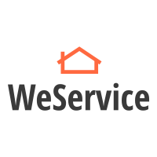

# WeService

"WeService" es una red social que permite interactuar en un contexto de prestación y consumo de servicios a domicilio.

[Enlace Deploy WeService]()

## Índice

* [1. Funcionalidad](#1-funcionalidad)
* [2. Introducción a la aplicación](#2-introducción-a-la-aplicación)
* [3. Definición del producto](#3-definición-del-producto)
* [4. Nivel de experiencia y de interfaz](#4-nivel-de-experiencia-y-de-interfaz)
* [5. Iteración con usuarios](#5-iteración-con-usuarios)

***

## 1. Funcionalidad
El sitio web "WeService" fue implementada utilizando las tecnologías: HTML5, CSS3, JS ECMA6 y la plataforma Firebase de Google.
Esta red social le permite a un usuario registrado publicar servicios a domicilio y que el público general pueda realizar una búsqueda rápida y eficaz de aquellos servicios que requieran. Si a una persona le interesa un servicio en particular, debe registrarse y luego iniciar sesión para poder interactuar con el prestador del servicio.

## 2. Introducción a la aplicación
Este sitio web es de **carácter interactivo**, corresponde a una red social que actúa como una comunidad donde personas que comparten intereses similiares dentro del mundo de los servicios a domicilio, puedan conectarse entre sí. 
Le permite a un usuario-que requiere de un servicio a domicilio específico-buscar dentro de las publicaciones existentes sin necesidad de registrarse en la aplicación. Sin embargo, si desea contactar al prestador de servicio, debe obligatoriamente crearse una cuenta.
El usuario que quiera actuar como prestador de un servicio, debe estar registrado y mantener un perfil de usuario actualizado.

## 3. Definición del producto

### Hipótesis
Para muchas personas es muy cómodo comprar servicios que se realicen en su hogar y, habitualmente, los contactos de las personas que prestan este tipo de servicios son obtenidos a través de redes sociales como, Facebook e Instagram o simplememte a través de la publicidad generada por el "boca a boca".
Es por esto que, resultaría múy útil contar con una red social que acoga al binomio compuesto por los prestadores de servicio a domicilio y los usuarios que requieren dichos servicios.

### Escenario
Pueden existir dos escenarios posibles según quien sea el usuario del sitio web:
1. Una mujer de 30 años requiere publicar el oficio al cual se dedica en una plataforma confiable y segura. Ella realiza alisado de pelo con keratina que realiza en la comodidad de los hogares de sus clientes. Ella necesita promocionar y publicitar su servicio para captar más clientela y así potenciar su venta. 

2. Una joven necesita buscar servicios de alisado con keratina a domicilio para cotizar y contratar el más conveniente en precio-calidad. A ella le gustaría contactar a la persona seleccionada a través de WhatsApp, por lo que necesita conseguir su número telefónico,y así poder resolver dudas y finalmente coordinar el día y horario para concretar el servicio.

### Principales usuarios:
Nuestra red social está dirigida a dos usuarios objetivo:
1. Usuario nativo digital, de cualquier edad y sexo, que actúa como prestador de servicios a domicilio y que necesita publicar su oficio u otro. Estos individuos no deben poseer un local comercial físico.

2. Usuario nativo digital, de cualquier edad y sexo, que consume servicios a domicilio, por lo que necesita realizar una búsqueda de ellos.

### Objetivo principal:
Posicionar a nuestro sitio web como una de las principales redes sociales para publicar y buscar servicios a domicilio.

### Investigación

### Historias de usuario
La planificación se realizó en utilizando la herarmienta "issues" de GitHub, ahí también se redactaron las historias de usuario:

[Enlace GitHub](https://github.com/rinarive/SCL012-Social-Network/projects/1)

### Objetivos del usuario en relación al producto

- Un usuario de público en general podrá acceder a la sección de publicaciones a revisar las últimas actualizaciones, además de buscar un servicio en particular a fin de contactar a la persona que lo provee.
- El usuario prestador de servicio a domicilio luego de registrarse en la red social podrá: publicar el trabajo que realiza e interactuar con las demás personas que estén registradas.
- El usuario 

## 4. Nivel de experiencia y de interfaz
Lo primero fue definir los contenidos y funciones necesarios para la aplicación, para ir encaminando una experiencia de viaje coherente y agradable.
Luego, se pasó a la fase de prototipado:

## Etapas del prototipado

a) Prototipos de baja fidelidad (wireframes) 

- **Sketch a mano alzada:**
Luego de decidir finalmente la temática y el objetivo de nuestra red social, comenzamos a concretar en papel la idea de diseño:

a) Prototipos de alta fidelidad (mockup)
- **Figma:**

Para desarrollar nuestro mockup de alta fidelidad, se utilizó [Figma](https://www.figma.com/), para así integrar los colores y formas, a fin de acercarnos más al diseño final.

[Ver prototipo de Alta fidelidad completo aquí](https://www.figma.com/proto/lJY8GH2v8MDmZcj3LtE8PB/Untitled?node-id=2%3A2&scaling=scale-down)

## 5. Iteración con usuarios

### Video de Testeo 1 

https://www.loom.com/

### Video de Testeo 2 

https://www.loom.com/

### Test de usabilidad

Luego de la aplicación de los test de usabilidad, se pudo identificar los siguientes comentarios/problemas:

1. 
2. 
3. 

### Resumen de Feedback de usuarios 

# Diseño de interfaz:

A continuación, se describen los aspectos de diseño visual respecto del futuro producto digital (basado en las iteraciones con usuarios).

- **Proximidad:** 

- **Repetición:** 

- **Alineación:** 

- **Contraste:** 

- **Tipografía:** 

- **Color:** 

